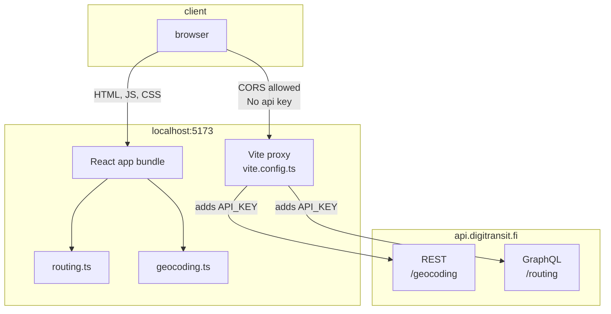

# TypeScript, REST ja GraphQL -reittiopas

Tämä harjoitus soveltaa REST-apien ja GraphQL-rajapintojen käyttöä TypeScript-kielellä. Projektissa rakennetaan hyvin yksinkertaistettu versio [reittioppaasta](https://www.reittiopas.fi), joka hyödyntää [Digitransitin](https://digitransit.fi/) paikkatietoja sekä reitityspalveluja.

Harjoitus on toteutettu [React + Vite -sovelluksena](https://vite.dev/), mutta keskitymme HTTP-rajapintojen hyödyntämiseen, asynkroniseen ohjelmointiin ja GraphQL-kyselyiden tekemiseen. Harjoituksessa ei tarvitse perehtyä Reactiin tai tehdä muutoksia komponentteihin.


## Kehitysympäristö

Tämä tehtävä on suunniteltu ratkaistavaksi [kehityskontissa](https://code.visualstudio.com/docs/devcontainers/containers) tai [CodeSpacessa](https://github.com/features/codespaces). Repositorio sisältää valmiin [`devcontainer.json`-tiedoston](./.devcontainer/devcontainer.json), jossa on määritetty kehitysympäristön asetukset. Kehityskontti eristää projektin muusta käyttöjärjestelmästä, joten sillä voi olla myös positiivisia tietoturvavaikutuksia.

Jos ajat projektia kehityskontissa, käynnistä Viten kehityspalvelin komennolla `npm run dev -- --host`, jotta sovellus hyväksyy yhteydet myös kontin ulkopuolisesta selaimestasi.

Halutessasi voit ratkaista tehtävän myös paikallisessa kehitysympäristössä, kunhan sinulla on tuore Node.js-versio sekä npm-paketinhallinta asennettuna.


## Mikä on GraphQL?

GraphQL-rajapintoihin tutustumiseksi suosittelemme seuraavia kahta videota:

[**GraphQL Explained in 100 Seconds**](https://www.youtube.com/watch?v=eIQh02xuVw4) by Fireship *2:22*

[**GraphQL Client Tutorial With Fetch**](https://www.youtube.com/watch?v=0ZJI4cBS4JM) by Web Dev Simplified *15:37*

Lisäksi suosittelemme lukemaan Digitransitin [GraphQL](https://digitransit.fi/en/developers/apis/1-routing-api/0-graphql)- sekä [GraphiQL](https://digitransit.fi/en/developers/apis/1-routing-api/1-graphiql/)-sivut.


## Mikä on digitransit?

> *"Digitransit Platform is an open source journey planning solution that combines several open source components into a modern, highly available route planning service. Route planning algorithms and APIs are provided by Open Trip Planner (OTP). OTP is a great solution for general route planning but in order to provide top-notch journey planning other components such as Mobile friendly user interface, Map tile serving, Geocoding, and various data conversion tools are needed. Digitransit platform provides these tools."*
>
> https://digitransit.fi/en/developers/

Tässä esimerkkiprojektissa käytämme Digitransitin palveluista seuraavia rajapintoja:

* Geocoding API https://digitransit.fi/en/developers/apis/3-geocoding-api/
* Routing API https://digitransit.fi/en/developers/apis/1-routing-api/


## API-avaimet ja tunnistautuminen 🔐

Digitransit-rajapinnat vaativat tunnistautumista API-avainten avulla. Palveluun rekisteröityminen onnistuu ilmaiseksi osoitteessa https://portal-api.digitransit.fi/. Rekisteröinnin jälkeen voit "tilata" itsellesi "Digitransit developer API"-palvelun "Products"-välilehdellä. Tilauksen jälkeen löydät API-avaimesi "Profile"-välilehdeltä.

> [!WARNING]
> Älä tallenna API-avaintasi suoraan lähdekoodiin äläkä lisää sitä versionhallintaan. Käytä sen sijaan ympäristömuuttujaa.

Määrittele API-avain ympäristömuuttujaksi nimellä `DIGITRANSIT_SUBSCRIPTION_KEY`. Voit tehdä tämän esimerkiksi luomalla `.env`-tiedoston projektin juureen. Löydät esimerkin [`.env.example`-tiedostosta](./.env.example). Lisättyäsi tiedoston tai tehtyäsi siihen muutoksia, käynnistä kehityspalvelin uudelleen. Vaihtoehtoisesti voit asettaa muuttujan käyttöjärjestelmääsi tai koodieditoriisi ympäristömuuttujaksi.

`.env`-tiedostoa **ei tule lisätä versionhallintaan** ja se onkin rajattu pois [.gitignore](./.gitignore)-tiedoston avulla.


## Asennus ja käynnistys

Projekti asennetaan ja käynnistetään kehitystilassa kuten mikä tahansa Vite-sovellus:

```bash
npm install
npm run dev

npm run dev -- --host # jos ajat kehityskontissa
```

Kun sovellus on käynnistynyt, siirry osoitteeseen `http://localhost:5173` tai muuhun Viten tulostamaan porttiin.

Jos sovellus kaatuu virheeseen `Error: Missing DIGITRANSIT_SUBSCRIPTION_KEY environment variable`, tarkista että olet määritellyt ympäristömuuttujan oikein ja avaa tarvittaessa uusi terminaali-ikkuna, jotta ympäristömuuttujat päivittyvät.


## Proxy-konfiguraatio

Projektissa on proxy-palvelinkonfiguraatio tiedostossa [`vite.config.ts`](./vite.config.ts), joka:

1. **Ratkaisee potentiaaliset CORS-ongelmat:** Välittää pyynnöt Digitransit API:hin kehityspalvelimen kautta
2. **Lisää tunnistautumisen:** Liittää automaattisesti API-avaimen jokaiseen pyyntöön
3. **Piilottaa API-avaimen:** API-avain ei näy frontend-koodissa tai selaimessa



Proxy käsittelee kaksi API-endpointtia:
- `/geocoding/*` → `https://api.digitransit.fi/geocoding/*` (REST API osoitehakuun)
- `/routing/*` → `https://api.digitransit.fi/routing/*` (GraphQL API reititukseen)

Jos ympäristömuuttuja on määritelty oikein ja kehityspalvelin on käynnissä, voit testata proxyä avaamalla selaimessa osoitteen http://localhost:5173/geocoding/v1/search?text=kamppi&size=1. Yhteyden pitäisi onnistua ja selaimen pitäisi näyttää JSON-vastaus, joka sisältää kampissa sijaitsevat koordinaatit.

Suorat yhteydet Digitransitin API:hin eivät onnistu, koska ne vaativat API-avaimen. Lisäksi usein CORS-rajoitukset ([Cross-Origin Resource Sharing](https://developer.mozilla.org/en-US/docs/Web/HTTP/Guides/CORS)) estävät sovellusta ottamasta yhteyksiä suoraan REST-rajapintoihin.

```diff
+ # oman kehityspalvelimen kautta tehty pyyntö onnistuu:
+ curl http://localhost:5173/geocoding/v1/search?text=kamppi&size=1

- # suora pyyntö Digitransitin API:hin epäonnistuu: "Access denied due to missing subscription key"
- curl https://api.digitransit.fi/geocoding/v1/search?text=kamppi&size=1
```


## Projektin tiedostorakenne

Projektin tärkeimmät tiedostot sijaitsevat `src`-hakemistossa:

```
src/
├── components/
│   ├── AddressInput.tsx    # Osoitteen syöttökenttä, joka hakee osoitteen koordinaatit REST API:sta
│   └── ItineraryView.tsx   # Yksittäisen reittisuunnitelman näyttö
│
├── clients/
│   ├── geocoding.ts        # operaatiot osoitteiden hakemiseksi osoitteilla tai paikkojen nimillä (REST)
│   └── routing.ts          # operaatiot reittien hakemiseksi (GraphQL)
│
├── types/
│   ├── GeocodingApi.ts     # sijaintitietojen tyyppimäärittelyt
│   └── RoutingApi.ts       # reittien tyyppimäärittelyt
│
└── App.tsx                 # päänäkymä
```

Näistä tiedostoista [geocoding.ts](./src/clients/geocoding.ts) ja [routing.ts](./src/clients/routing.ts) ovat tehtävän kannalta keskeiset, koska niihin toteutetaan REST- ja GraphQL-kutsut.


## Tehtävän osa 1: [src/clients/geocoding.ts](./src/clients/geocoding.ts)

Tehtävänäsi on täydentää `src/clients/geocoding.ts`-tiedostossa oleva `addressSearch`-funktio. Funktion tulee hyödyntää [Geocoding API:a](https://digitransit.fi/en/developers/apis/3-geocoding-api/) ja palauttaa annetulla hakutekstillä saatu API-rajapinnan vastaus sellaisenaan. Vastaukselle on määritetty valmis TypeScript-tyyppi [AddressSearchResponse](./src/types/GeocodingApi.ts).

Täydennettyäsi funktion, testaa sen toimivuutta kirjoittamalla reittihaun näkymässä (http://localhost:5173) hakukenttään esimerkiksi "Kamppi" ja painamalla "Search". Osoitteen pitäisi löytyä ja tuloksen tulisi näkyä tekstikentän alapuolella. Mikäli toiminto ei toimi, tarkista mahdolliset virheilmoitukset sekä selaimen että terminaalin konsolista.


## Tehtävän osa 2: [src/clients/routing.ts](./src/clients/routing.ts)

Tämän osan suorittaminen edellyttää, että olet saanut ensimmäisen osan toimimaan. Tarkoituksena on tällä kertaa hyödyntää [Routing API:a](https://digitransit.fi/en/developers/apis/1-routing-api/) GraphQL-kyselyiden avulla.

Tehtävänäsi on täydentää [`src/clients/routing.ts`-tiedostossa](./src/clients/routing.ts) oleva funktio `fetchItineraries`. Funktion tulee hyödyntää Digitransitin Routing API:a ja etsiä annetulla lähtöpaikan ja määränpään koordinaateilla reittivaihtoehtoja.

Digitransit-rajapinnan vastaukselle on määritetty valmis TypeScript-tyyppi [RoutingResponse](./src/types/RoutingApi.ts), joka kuvaa API:n palauttamaa dataa. Funktiosi tulee poimia tästä vastauksesta reittisuunnitelmat (`data.plan.itineraries`) ja palauttaa ne paluuarvona.

Kyselyssä tulee hyödyntää GraphQL:n `plan`-operaatiota, joka saa parametreinaan lähtö- ja määränpään koordinaatit. Lisäksi voit määritellä, kuinka monta reittivaihtoehtoa haluat saada vastauksena. Alla on esitetty esimerkkikysely, [jota voit kokeilla GraphiQL-käyttöliittymässä](https://api.digitransit.fi/graphiql/hsl?query=%257B%250A%2520%2520%2520plan%28%250A%2520%2520%2520%2520%2520%2520from%253A%2520%257B%2520lat%253A%252060.318933%252C%2520lon%253A%252024.968296%2520%257D%250A%2520%2520%2520%2520%2520%2520to%253A%2520%257B%2520lat%253A%252060.149087%252C%2520lon%253A%252024.984228%2520%257D%250A%2520%2520%2520%2520%2520%2520numItineraries%253A%25203%250A%2520%2520%2520%29%2520%257B%250A%2520%2520%2520%2520%2520%2520itineraries%2520%257B%250A%2520%2520%2520%2520%2520%2520%2520%2520%2520%2520%2520%2520start%250A%2520%2520%2520%2520%2520%2520%2520%2520%2520%2520%2520%2520end%250A%2520%2520%2520%2520%2520%2520%2520%2520%2520%2520%2520%2520walkTime%250A%2520%2520%2520%2520%2520%2520%2520%2520%2520%2520%2520%2520walkDistance%250A%2520%2520%2520%2520%2520%2520%2520%2520%2520%2520%2520%2520legs%2520%257B%250A%2520%2520%2520%2520%2520%2520%2520%2520%2520%2520%2520%2520%2520%2520%2520from%2520%257B%250A%2520%2520%2520%2520%2520%2520%2520%2520%2520%2520%2520%2520%2520%2520%2520%2520%2520%2520name%250A%2520%2520%2520%2520%2520%2520%2520%2520%2520%2520%2520%2520%2520%2520%2520%2520%2520%2520lat%250A%2520%2520%2520%2520%2520%2520%2520%2520%2520%2520%2520%2520%2520%2520%2520%2520%2520%2520lon%250A%2520%2520%2520%2520%2520%2520%2520%2520%2520%2520%2520%2520%2520%2520%2520%257D%250A%2520%2520%2520%2520%2520%2520%2520%2520%2520%2520%2520%2520%2520%2520%2520to%2520%257B%250A%2520%2520%2520%2520%2520%2520%2520%2520%2520%2520%2520%2520%2520%2520%2520%2520%2520%2520name%250A%2520%2520%2520%2520%2520%2520%2520%2520%2520%2520%2520%2520%2520%2520%2520%2520%2520%2520lat%250A%2520%2520%2520%2520%2520%2520%2520%2520%2520%2520%2520%2520%2520%2520%2520%2520%2520%2520lon%250A%2520%2520%2520%2520%2520%2520%2520%2520%2520%2520%2520%2520%2520%2520%2520%257D%250A%2520%2520%2520%2520%2520%2520%2520%2520%2520%2520%2520%2520%2520%2520%2520startTime%250A%2520%2520%2520%2520%2520%2520%2520%2520%2520%2520%2520%2520%2520%2520%2520endTime%250A%2520%2520%2520%2520%2520%2520%2520%2520%2520%2520%2520%2520%2520%2520%2520mode%250A%2520%2520%2520%2520%2520%2520%2520%2520%2520%2520%2520%2520%2520%2520%2520duration%250A%2520%2520%2520%2520%2520%2520%2520%2520%2520%2520%2520%2520%2520%2520%2520distance%250A%2520%2520%2520%2520%2520%2520%2520%2520%2520%2520%2520%2520%2520%2520%2520route%2520%257B%250A%2520%2520%2520%2520%2520%2520%2520%2520%2520%2520%2520%2520%2520%2520%2520%2520%2520%2520shortName%250A%2520%2520%2520%2520%2520%2520%2520%2520%2520%2520%2520%2520%2520%2520%2520%2520%2520%2520longName%250A%2520%2520%2520%2520%2520%2520%2520%2520%2520%2520%2520%2520%2520%2520%2520%257D%250A%2520%2520%2520%2520%2520%2520%2520%2520%2520%2520%2520%2520%257D%250A%2520%2520%2520%2520%2520%2520%257D%250A%2520%2520%2520%257D%250A%257D):

```graphql
{
   plan(
      from: { lat: 60.318933, lon: 24.968296 }
      to: { lat: 60.149087, lon: 24.984228 }
      numItineraries: 3
   ) {
      itineraries {
            start
            end
            walkTime
            walkDistance
            legs {
               from {
                  name
                  lat
                  lon
               }
               to {
                  name
                  lat
                  lon
               }
               startTime
               endTime
               mode
               duration
               distance
               route {
                  shortName
                  longName
               }
            }
      }
   }
}
```

Suosittelemme hyödyntämään [Digitransitin GraphiQL-palvelua](https://digitransit.fi/en/developers/apis/1-routing-api/1-graphiql/) kyselyiden suunniteluun ja testaamiseen:

> *"It is highly recommended to use GraphiQL when familiarizing yourself with the Routing API."*
>
> https://digitransit.fi/en/developers/apis/1-routing-api/1-graphiql/


## Lisenssit

### Digitransit

> *"Digitransit Platform is an open source journey planning solution that combines several open source components into a modern, highly available route planning service. Route planning algorithms and APIs are provided by Open Trip Planner (OTP). OTP is a great solution for general route planning but in order to provide top-notch journey planning other components such as Mobile friendly user interface, Map tile serving, Geocoding, and various data conversion tools are needed. Digitransit platform provides these tools."*
>
> https://digitransit.fi/en/developers/

Digitransit makes the data available based on JHS-189 (permission to use the open data) and [Creative Commons name 4.0 (CC BY)](https://creativecommons.org/licenses/by/4.0/) licensing.

### React

React-kirjasto on lisensoitu MIT-lisenssillä: https://github.com/facebook/react/blob/main/LICENSE.

### Vite

Vite-työkalu on lisensoitu MIT-lisenssillä: https://github.com/vitejs/vite/blob/main/LICENSE.

### Pico CSS

[Pico CSS](https://picocss.com/) on lisensoitu MIT-lisenssillä: https://github.com/picocss/pico/blob/master/LICENSE.md.

### Tämä tehtävä

Tämän tehtävän on kehittänyt Teemu Havulinna ja se on lisensoitu [Creative Commons BY-NC-SA -lisenssillä](https://creativecommons.org/licenses/by-nc-sa/4.0/). Tehtävänannon, lähdekoodien ja testien toteutuksessa on hyödynnetty ChatGPT-kielimallia sekä GitHub copilot -tekoälyavustinta.
